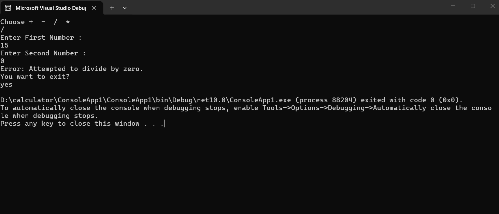

# Basic C# Console Calculator

## Description
A simple console-based calculator application that allows users to perform basic arithmetic operations (+, -, *, /). The application features a continuous loop so users can perform multiple calculations without restarting, and includes robust error handling to safely manage invalid inputs and division by zero.

## Technologies Used
* C#
* .NET Console Application

## How to Run
1. Open the project folder in your terminal.
2. Type `dotnet run` and press Enter (or open in Visual Studio and press `F5`).
3. Follow the on-screen prompts to choose an operator and enter your numbers.

## Screenshot

## Author
Yazan Makhoul
